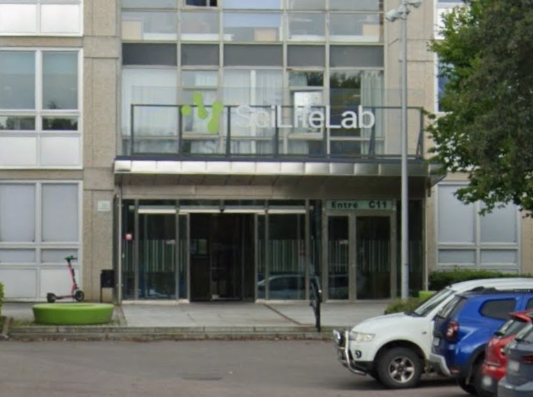
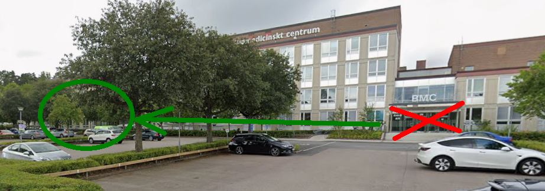
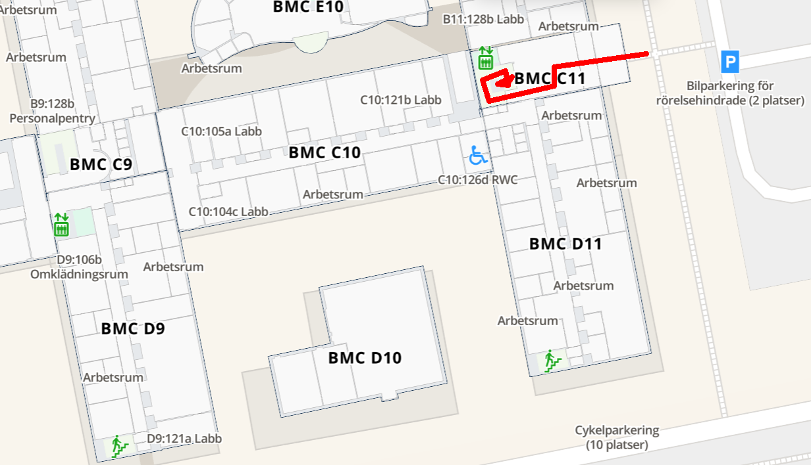
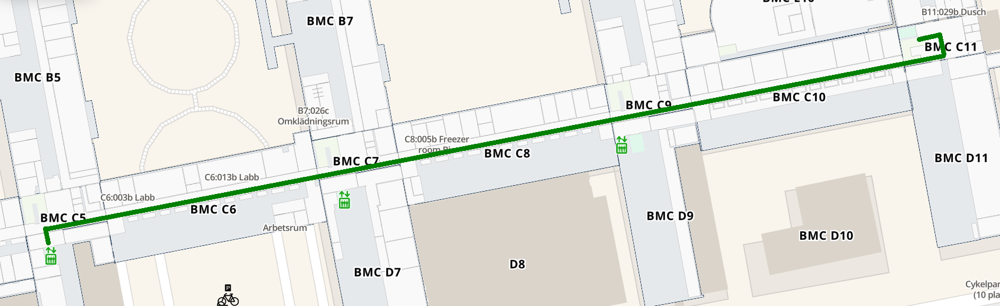

# Office

The office has room number D5:514c and can be found
[here (in Mazemap)](https://link.mazemap.com/1o82OwUi).

To reach my office, enter BMC at entrance C11:

BMC has another entrance (see below). Use C11.

After entering BMC entrance C11,
in the hallways, take the stairs down.

> Enter at entrance C11. In the hallways, take the stairs down

In the basement, turn right and follow the long corridor
until the third square. You will see 'C5' painted in huge letters
at the wall of the staircase. Take the elevator or stairs to floor 5.

> turn right and follow the loooong corridor until the third 'square'
> Take the elevator or stairs to floor 5.

When arriving at floor 5, there are four easy chairs.
We will meet there :-)
